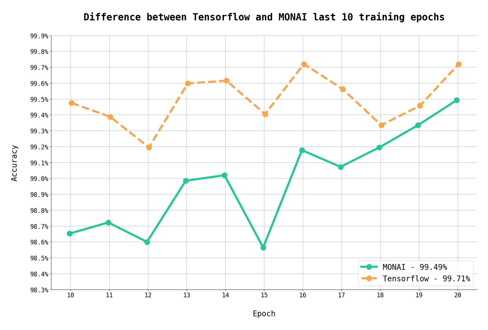

### Brain Tumour Classification Models with Tensorflow and MONAI

The goal of this project was to train two AI models using neural networks from TensorFlow and MONAI in order to classify 3 types of brain tumour, as well as to compare the results obtained during the training process.

Below is a graph that show how TensorFlow and MONAI neural networks performed in the last 10 epochs.

The model trained with MONAI neural networks for <b>20 epochs</b> reached an accuracy of <b>99.49%</b>, while the one trained with TensorFlow for the same number of epochs reached <b>99.71%</b> accuracy. Although there is not a big difference in the accuracy results, the time required to train the model with TensorFlow was incomparable smaller as we can see in the table above.

<h8>Table 1. The results from training process</h8>

| Neural Network | Final accuracy | Final loss | Number of epochs | Runtime    |
|----------------|----------------|------------|------------------|------------|
| TensorFlow     | 99.71%         | 1.13       | 20               | 32 minutes |
| MONAI          | 99.49%         | 5.31       | 20               | 6.5 hours  |

The files "monai_train_classification_model_with_data.ipynb" and "tensorflow_train_classification_model.ipynb" contain the source codes for training the models, while the file "monai_vs_tensorflow_study.ipynb" is the source code for the comparative study.

The dataset was taken from Kaggle: https://www.kaggle.com/datasets/masoudnickparvar/brain-tumor-mri-dataset

You can find more details obout this study in the article I published on LinkedIn by accessing this link: https://www.linkedin.com/pulse/tensorflow-monai-training-process-difference-brain-tumour-crintea-fbr4f

